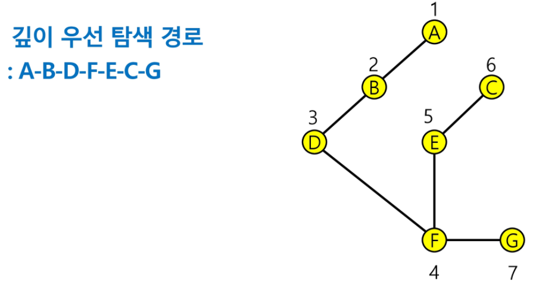

# Stack1

- 스택
- 재귀호출
- Memoization&DP
- DFS

---

> ## 스택
>
> - 물건을 쌓아 올리듯 자료를 쌓아 올린 형태의 자료구조
>
> - 스택에 저장된 자료는 선형 구조를 가짐
>
>   - 선형구조 : 자료 간의 관계가 1대 1의 관계를 가짐
>   - 비선형구조 : 자료 간의 관계가 1대 N의 관계를 가짐(ex. 트리)
>
> - 스택에 자료를 삽입하거나 스택에서 자료를 꺼낼 수 있음
>
> - 후입선출(LIFO) : 마지막에 삽입한 자료를 가장 먼저 꺼냄
>
>   > **구현**
>   >
>   > 스택을 프로그램에서 구현하기 위해서 필요한 자료구조와 연산
>
>   - 자료구조 : 자료를 선형으로 저장할 저장소
>
>     - 배열을 사용할 수 있음
>     - 저장소 자체를 스택이라 부르기도 함
>     - 마지막에 삽입된 원소의 위치는 top
>
>   - 연산
>
>     - 삽입 : 저장소에 자료를 저장함 (push)
>     - 삭제 : 저장소에서 역순으로 자료를 꺼냄 (pop)
>     - 스택이 공백인지 아닌지 확인 : isEmpty
>     - 스택의 top에 있는 item(원소)을 반환 : peek
>
>   - 스택의 push 알고리즘
>
>     ```python
>     def push(item):
>     	s.append(item)
>     ```
>
>   - 스택의 pop 알고리즘
>
>     ```python
>     def pop():
>     	if len(s) == 0:
>     		return
>     	else:
>     		return s.pop(-1)
>     ```
>
>   - 1차원 배열을 사용하여 구현할 경우 구현이 용이하다는 장점이 있지만 스택의 크기를 변경하기가 어렵다는 단점이 있음


> ## 재귀호출
>
> - 자기 자신을 호출하여 순환 수행되는 것
> - 함수에서 실행해야 하는 작업의 특성에 따라 일반적인 호출방식보다 재귀호출방식을 사용하여 함수를 만들면 프로그램의 크기를 줄이고 간단하게 작성


> ## Memoization
>
> - 메모이제이션은 컴퓨터 프로그램을 실행할 때 이전에 계산한 값을 메모리에 저장해서 매번 다시 계산하지 않도록하여 전체적인 실행속도를 빠르게 하는 기술
> - 동적 계획법의 핵심


> ## DP(Dynamic Programming)
>
> - 동적 계획 알고리즘은 그리디 알고리즘과 같이 최적화 문제를 해결하는 알고리즘
> - 동적 계획 알고리즘은 먼저 입력 크기가 작은 부분 문제들을 모두 해결한 후에 그 해들을 이용하여 보다 큰 크기의 부분 문제들을 해결하여, 최종적으로 원래 주어진 입력의 문제를 해결하는 알고리즘
> - memoization을 재귀적 구조에 사용하는 것보다 반복적 구조로 DP를 구현한 것이 성능 면에서 보다 효율적 -> 재귀적 구조는 내부에 시스템 호출 스택을 사용하는 오버헤드가 발생하기 때문


> ## DFS(깊이우선탐색)
>
> - 시작 정점의 한 방향으로 갈 수 있는 경로가 있는 곳까지 깊이 탐색해 가다가 더이상 갈 곳이 없게 되면, 가장 마지막에 만났던 갈림길 간선이 있는 정점으로 되돌아와서 다른 방향의 정점으로 탐색을 계속 반복하여 결국 모든 정점을 방문하는 순회 방법
> - 가장 마지막에 만났던 갈림길의 정점으로 되돌아가서 다시 깊이 우선 탐색을 반복해야 하므로 후입선출 구조의 스택 사용
>
> 