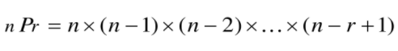
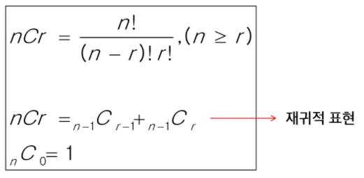

#  완전검색 & 그리디

- 반복과 재귀
- 완전검색기법
- 조합적 문제
- 탐욕 알고리즘(Greedy)

---

> ## 반복과 재귀
>
> - 반복과 재귀는 유사한 작업을 수행
>
> - 반복은 수행하는 작업이 완료될 때까지 계속 반복
>
> - 재귀는 주어진 문제의 해를 구하기 위해 동일하면서 더 작은 문제의 해를 이용하는 방법
>
>   > **반복구조**
>
>   ```
>   초기화, 조건검사, 반복할 명령문 실행, 업데이트
>   ```
>
>   > **재귀적 알고리즘**
>
>   - 집합에 포함되어 있는 원소로 induction을 생성하기 위한 시드 역할
>   - 새로운 집합의 원소를 생성하기 위해 결합되어지는 방법
>
>   > **재귀 함수**
>
>   - 함수 내부에서 직접 혹은 간접적으로 자기 자신을 호출하는 함수
>   - 일반적으로 재귀적 정의를 이용해 재귀 함수를 구현
>   - 기본 부분과 유도 부분으로 구성
>   - 재귀적 프로그램을 작성하는 것은 반복 구조에 비해 간결하고 이해하기 쉬움
>   - 재귀 호출은 반복적인 스택의 사용을 의미하며 메모리 및 속도에서 성능저하가 발생
>   - 입력 값 n이 커질수록 재귀 알고리즘은 반복에 비해 비효율적일 수 있음
>
> |                |                  재귀                   |        반복         |
> | :------------: | :-------------------------------------: | :-----------------: |
> |      종료      | 재귀 함수 호출이 종료되는 베이스 케이스 | 반복문의 종료 조건  |
> |   수행 시간    |              (상대적) 느림              |        빠름         |
> |  메모리 공간   |           (상대적) 많이 사용            |      적게 사용      |
> | 소스 코드 길이 |                짧고 간결                |        길다         |
> | 소스 코드 형태 |                선택 구조                |      반복 구조      |
> |  무한 반복시   |             스택 오버플로우             | CPU를 반복해서 점유 |


> ## 조합적 문제
>
> > **순열**
>
> - 서로 다른 것들 중 몇 개를 뽑아서 한 줄로 나열하는 것
> - 서로 다른 n개 중 r개를 택하는 순열은 다음과 같은 식이 성립
> - nPn = n! 이라고 표기하며 Factorial이라 부름
>
> 
>
> > **부분 집합**
>
> - 집합에 포함된 원소들을 선택하는 것
>
> > **조합**
>
> - 서로 다른 n개의 원소 중 r개를 순서 없이 골라낸 것을 조합(combination)이라고 부름
>
>   


> ## 탐욕 알고리즘
>
> - 최적해를 구하는 데 사용되는 근시안적인 방법
> - 일반적으로 머리 속에 떠오르는 생각을 검증 없이 바로 구현하면 Greedy 접근이 됨
> - 여러 경우 중 하나를 선택할 때마다 그 순간에 최적이라고 생각되는 것을 선택해 나가는 방식으로 진행하여 최종적인 해답에 도달
> - 각 선택 시점에서 이루어지는 결정은 지역적으로는 최적이지만, 그 선택들을 계속 수집하여 최종적인 해답을 만들었다고 하여, 그것이 **최적이라는 보장은 없음**
> - 최적화 문제란 가능한 해들 중에서 가장 좋은 해를 찾는 문제
>
> > **동작 과정**
>
> 1. 해 선택 : 현재 상태에서 부분 문제의 최적 해를 구한 뒤, 이를 부분해 집합에 추가
> 2. 실행 가능성 검사 : 새로운 부분해 집합이 실행가능한지를 확인. 곧, 문제의 제약 조건을 위반하지 않는지를 검사
> 3. 해 검사 : 새로운 부분해 집합이 문제의 해가 되는지를 확인. 아직 전체 문제의 해가 완성되지 않았다면 1의 해 선택부터 다시 시작
>
> |                          탐욕 기법                           |                     동적 계획법                      |
> | :----------------------------------------------------------: | :--------------------------------------------------: |
> | 매 단계에서, 가장 좋게 보이는 것을 빠르게 선택<br />-> 지역 최적 선택 | 매 단계의 선택은 해결한 하위 문제의 해를 기반으로 함 |
> |     하위 문제를 풀기 전에 (탐욕적) 선택이 먼저 이루어짐      |                하위 문제가 우선 해결                 |
> |                        Top-down 방식                         |                    Bottom-up 방식                    |
> |                    일반적으로 빠르고 간결                    |                  좀 더 느리고 복잡                   |
>
> 