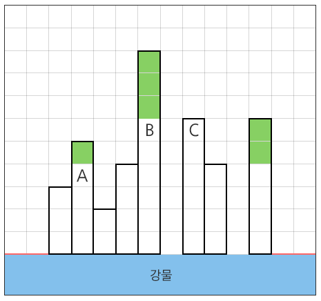

### SWEA 1206. View

---

강변에 빌딩들이 옆으로 빽빽하게 밀집한 지역이 있다.

이곳에서는 빌딩들이 너무 좌우로 밀집하여, 강에 대한 조망은 모든 세대에서 좋지만 왼쪽 또는 오른쪽 창문을 열었을 때 바로 앞에 옆 건물이 보이는 경우가 허다하였다.

그래서 이 지역에서는 왼쪽과 오른쪽으로 창문을 열었을 때, 양쪽 모두 거리 2 이상의 공간이 확보될 때 조망권이 확보된다고 말한다.

빌딩들에 대한 정보가 주어질 때, 조망권이 확보된 세대의 수를 반환하는 프로그램을 작성하시오.

아래와 같이 강변에 8채의 빌딩이 있을 때, 연두색으로 색칠된 여섯 세대에서는 좌우로 2칸 이상의 공백이 존재하므로 조망권이 확보된다. 따라서 답은 6이 된다.



A와 B로 표시된 세대의 경우는 왼쪽 조망은 2칸 이상 확보가 되었지만 오른쪽 조망은 한 칸 밖에 확보가 되지 않으므로 조망권을 확보하지 못하였다.

C의 경우는 반대로 오른쪽 조망은 2칸이 확보가 되었지만 왼쪽 조망이 한 칸 밖에 확보되지 않았다.

```python
for tc in range(1, 11):
    N = int(input())
    buildings = list(map(int, input().split()))
    result = 0

    for i in range(2, N-2):
        if buildings[i] > buildings[i-1] and buildings[i] > buildings[i-2] and buildings[i] >buildings[i+1] and buildings[i] > buildings[i+2]:
            if buildings[i-1] > buildings[i-2] and buildings[i-1] > buildings[i+1] and buildings[i-1] > buildings[i+2]:
                result += (buildings[i] - buildings[i-1])
            elif buildings[i-2] > buildings[i+1] and buildings[i-2] > buildings[i+2]:
                result += (buildings[i] - buildings[i-2])
            elif buildings[i+1] > buildings[i+2]:
                result += (buildings[i] - buildings[i+1])
            else:
                result += (buildings[i] - buildings[i+2])
    print('#{0} {1}'.format(tc,result))
```

