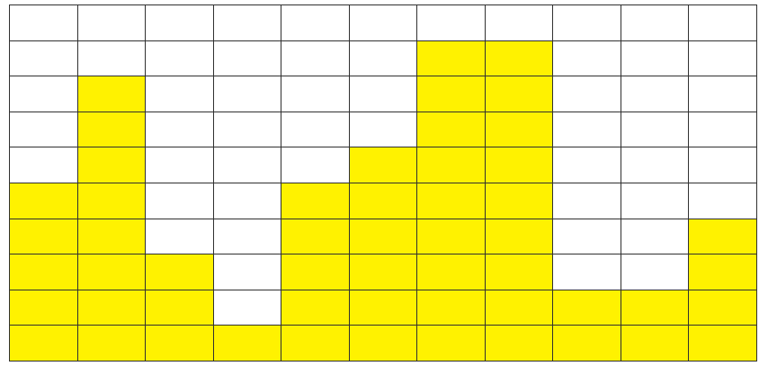

### SWEA 1208. Flatten

---

한 쪽 벽면에 다음과 같이 노란색 상자들이 쌓여 있다.

높은 곳의 상자를 낮은 곳에 옮기는 방식으로 최고점과 최저점의 간격을 줄이는 작업을 평탄화라고 한다.

평탄화를 모두 수행하고 나면, 가장 높은 곳과 가장 낮은 곳의 차이가 최대 1 이내가 된다.

평탄화 작업을 위해서 상자를 옮기는 작업 횟수에 제한이 걸려있을 때, 제한된 횟수만큼 옮기는 작업을 한 후 최고점과 최저점의 차이를 반환하는 프로그램을 작성하시오.



```python
def sort(X):  # 작은 순서대로 나열하는 함수
    for x in range(len(X)):
        for w in range(x + 1, len(X)):
            if X[x] > X[w]:
                X[x], X[w] = X[w], X[x]


for tc in range(1, 11):
    A = int(input()) 
    B = list(map(int, input().split())) 
    sort(B) 
    
    # 가장 큰 곳에서 가장 작은 곳으로 이동시키고 다시 작은 순서대로 나열하는 함수
    for i in range(A):
        B[0] += 1 
        B[-1] -= 1
        sort(B) 

    print("#{} {}".format(tc, B[-1] - B[0]))
```

