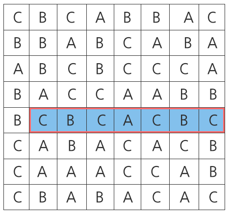

### SWEA 1216. 회문2

---

"기러기" 또는 "level" 과 같이 거꾸로 읽어도 제대로 읽은 것과 같은 문장이나 낱말을 회문(回文, palindrome)이라 한다.

주어진 100x100 평면 글자판에서 가로, 세로를 모두 보아 가장 긴 회문의 길이를 구하는 문제이다.



위와 같은 글자 판이 주어졌을 때, 길이가 가장 긴 회문은 붉은색 테두리로 표시된 7칸짜리 회문이다.

예시의 경우 설명을 위해 글자판의 크기가 100 x 100이 아닌 8 x 8으로 주어졌음에 주의한다.

```python
for tc in range(1, 11):
    tc = int(input())
    N = 100
    result = 1

    lst_1 = []
    for i in range(N):
        Data = input()
        lst_1.append(Data)
        for M in range(N, result, -1):
            if result > M:
                break
            for k in range(N-M+1):
                if Data[k:M+k] == Data[k:M+k][::-1]:
                    if len(Data[k:M+k]) > result:
                        result = len(Data[k:M+k])
    lst_2 = []
    lst_3 = ''
    for x in range(N):
        for y in lst_1:
            lst_3 += y[x]
        lst_2.append(lst_3)
        lst_3 =''

    for i in lst_2:
        for M in range(N, result, -1):
            if result > M:
                break
            for k in range(N-M+1):
                if i[k:M+k] == i[k:M+k][::-1]:
                    if len(i[k:M+k]) > result:
                        result = len(i[k:M+k])

    print("#%d %s"%(tc, result))
```

