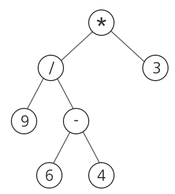

### SWEA 1232. 사칙연산

---


사칙연산으로 구성되어 있는 식은 이진 트리로 표현할 수 있다. 아래는 식 “(9/(6-4))*3”을 이진 트리로 표현한 것이다.

임의의 정점에 연산자가 있으면 해당 연산자의 왼쪽 서브 트리의 결과와 오른쪽 서브 트리의 결과를 사용해서 해당 연산자를 적용한다.



사칙연산 “+, -, *, /”와 양의 정수로만 구성된 임의의 이진트리가 주어질 때, 이를 계산한 결과를 출력하는 프로그램을 작성하라.

단, 중간 과정에서의 연산은 실수 연산으로 하되, 최종 결과값이 정수로 떨어지지 않으면 정수부만 출력한다.

```python
def cal(v):
    global sum
    if arr[v] == '+':
        return cal(left[v]) + cal(right[v])
    elif arr[v] == '-':
        return cal(left[v]) - cal(right[v])
    elif arr[v] == '*':
        return cal(left[v]) * cal(right[v])
    elif arr[v] == '/':
        return cal(left[v]) / cal(right[v])
    else:
        return int(arr[v])


for tc in range(1, 11):
    N = int(input())
    arr = ['']*(N+1)
    left = [0]*(N+1)
    right = [0] * (N + 1)
    for _ in range(N):
        temp = list(input().split())
        idx = int(temp[0])
        arr[idx] = temp[1]
        if len(temp) > 2: # 자식 노드가 있을 경우
            left[idx] = int(temp[2])
            right[idx] = int(temp[3])

    print('#{} {}'.format(tc, int(cal(1))))
```

