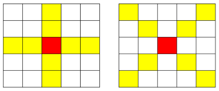

### SWEA 12712. 파리퇴치3

---

N x N 배열 안의 숫자는 해당 영역에 존재하는 파리의 개체 수를 의미한다.

아래는 N=5 의 예이다.



파리 킬러 스프레이를 한 번만 뿌려 최대한 많은 파리를 잡으려고 한다. 스프레이의 노즐이 + 형태로 되어있어, 스프레이는 + 혹은 x 형태로 분사된다. 스프레이를 M의 세기로 분사하면 노즐의 중심이 향한 칸부터 각 방향으로 M칸의 파리를 잡을 수 있다.
다음은 M=3 세기로 스프레이르 분사한 경우 파리가 퇴치되는 칸의 예로, +또는 x 중 하나로 분사된다. 뿌려진 일부가 영역을 벗어나도 상관없다.

한 번에 잡을 수 있는 최대 파리수를 출력하라.

```python
T = int(input())
for tc in range(T):
    N, M = map(int, input().split())
    arr = [list(map(int, input().split())) for _ in range(N)]
    dr = [-1, 0, 1, 0, -1, -1, 1, 1]
    dc = [0, 1, 0, -1, -1, 1, 1, -1]
    max = 0
    for i in range(N):
        for j in range(N):
            sum = arr[i][j]
            for a in range(4):
                for b in range(1, M):
                    r, c = i + dr[a]*b, j + dc[a]*b
                    if 0 <= r < N and 0 <= c < N:
                        sum += arr[r][c]
            if sum > max: max = sum
            sum = arr[i][j]
            for a in range(4, 8):
                for b in range(1, M):
                    r, c = i + dr[a]*b, j + dc[a]*b
                    if 0 <= r < N and 0 <= c < N:
                        sum += arr[r][c]
            if sum > max: max = sum

    print('#{} {}'.format(tc+1, max))
```

