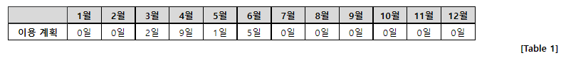

### SWEA 1952. 수영장

---

김 프로는 수영장을 이용한다.

김 프로는 지출이 너무 많아 내년 1년 동안 각 달의 이용 계획을 수립하고 가장 적은 비용으로 수영장을 이용할 수 있는 방법을 찾고 있다.

수영장에서 판매하고 있는 이용권은 아래와 같이 4 종류이다.

  ① 1일 이용권 : 1일 이용이 가능하다.

  ② 1달 이용권 : 1달 동안 이용이 가능하다. 1달 이용권은 매달 1일부터 시작한다.

  ③ 3달 이용권 : 연속된 3달 동안 이용이 가능하다. 3달 이용권은 매달 1일부터 시작한다.
    (11월, 12월에도 3달 이용권을 사용할 수 있다 / 다음 해의 이용권만을 구매할 수 있기 때문에 3달 이용권은 11월, 12월, 1윌 이나 12월, 1월, 2월 동안 사용하도록 구매할 수는 없다.)

  ④ 1년 이용권 : 1년 동안 이용이 가능하다. 1년 이용권은 매년 1월 1일부터 시작한다.

각 달의 이용 계획은 [Table 1]의 형태로 수립된다.



이용 계획에 나타나는 숫자는 해당 달에 수영장을 이용할 날의 수를 의미한다.

**각 이용권의 요금과 각 달의 이용 계획이 입력으로 주어질 때, 가장 적은 비용으로 수영장을 이용할 수 있는 방법을 찾고 그 비용을 정답으로 출력하는 프로그램을 작성하라.**

```python
# 요금 계산하는 함수
def cost(n, sum):
    global result
    if n > 12:
        if result > sum:
            result = sum
        return
    cost(n+1, sum+lst[n]*day)
    cost(n + 1, sum + mon)
    cost(n + 3, sum + mon_3)
    cost(n + 12, sum + year)

T = int(input())
for tc in range(1, T+1):
    day, mon, mon_3, year = map(int, input().split())
    lst = [0] + list(map(int, input().split()))
    result = 0xfffff
    cost(1,0)
    print('#{} {}'.format(tc, result))
```

