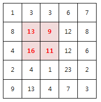

### SWEA 2001. 파리퇴치

---

N x N 배열 안의 숫자는 해당 영역에 존재하는 파리의 개수를 의미한다.

아래는 N=5 의 예이다.

M x M 크기의 파리채를 한 번 내리쳐 최대한 많은 파리를 죽이고자 한다.

죽은 파리의 개수를 구하라!

예를 들어 M=2 일 경우 위 예제의 정답은 49마리가 된다.

 

```python
T = int(input())
for tc in range(T):
    N, M = map(int, input().split())
    arr = [list(map(int, input().split())) for _ in range(N)]
    max = 0
    for i in range(N-M+1):
        for j in range(N-M+1):
            result = 0
            for a in range(M):
                for b in range(M):
                    result += arr[i+a][j+b]
            if result > max : max = result
    print('#{} {}'.format(tc+1, max))
```

