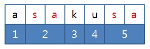

### SWEA 3143. 가장 빠른 문자열 타이핑

---

어떤 문자열 A를 타이핑하려고 한다.

그냥 한 글자씩 타이핑 한다면 A의 길이만큼 키를 눌러야 할 것이다.

여기에 속도를 조금 더 높이기 위해 어떤 문자열 B가 저장되어 있어서 키를 한번 누른 것으로 B전체를 타이핑 할 수 있다.

이미 타이핑 한 문자를 지우는 것은 불가능하다.

예를 들어 A=”asakusa”, B=”sa”일 때, 다음 그림과 같이 B를 두 번 사용하면 5번 만에 A를 타이핑 할 수 있다.



A와 B가 주어질 때 A 전체를 타이핑 하기 위해 키를 눌러야 하는 횟수의 최솟값을 구하여라.

```python
T = int(input())
for tc in range(T):
    A, B = input().split()
    i, result = 0, 0
    while i < len(A):
        if i+len(B) <= len(A) and A[i:i+len(B)] == B:
            result += 1
            i += len(B)
        else:
            result += 1
            i += 1
    print('#{} {}'.format(tc+1, result))
```

