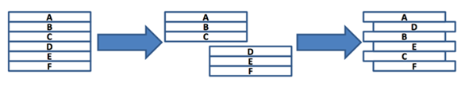

### SWEA 3499. 퍼펙트 셔플

---

카드를 퍼펙트 셔플 한다는 것은, 카드 덱을 정확히 절반으로 나누고 나눈 것들에서 교대로 카드를 뽑아 새로운 덱을 만드는 것을 의미한다. 

정확한 방식은 다음 그림과 같다.



N개의 카드가 있는 덱이 주어질 때 이를 퍼펙트 셔플하면 어떤 순서가 되는지 출력하는 프로그램을 작성하라.

만약 N이 홀수이면, 교대로 놓을 때 먼저 놓는 쪽에 한 장이 더 들어가게 하면 된다.

```python
T = int(input())
for tc in range(T):
    N = int(input())
    card = list(input().split())
    result = []
    if N % 2: # 홀
        for i in range((N+1)//2-1):
            result.append(card[i])
            result.append(card[i + (N+1)//2])
        result.append(card[(N+1)//2 - 1])
    else: # 짝
        for i in range(N//2):
            result.append(card[i])
            result.append(card[i + N // 2])
    print('#{}'.format(tc+1), *result)
```

