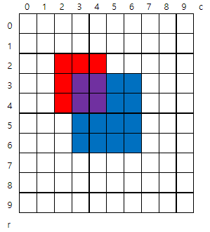

### SWEA 4836. 색칠하기

---

그림과 같이 인덱스가 있는 10x10 격자에 빨간색과 파란색을 칠하려고 한다.

N개의 영역에 대해 왼쪽 위와 오른쪽 아래 모서리 인덱스, 칠할 색상이 주어질 때, 칠이 끝난 후 색이 겹쳐 보라색이 된 칸 수를 구하는 프로그램을 만드시오.

주어진 정보에서 같은 색인 영역은 겹치지 않는다.



예를 들어 2개의 색칠 영역을 갖는 위 그림에 대한 색칠 정보이다.

2

2 2 4 4 1 ( [2,2] 부터 [4,4] 까지 color 1 (빨강) 으로 칠한다 )

3 3 6 6 2 ( [3,3] 부터 [6,6] 까지 color 2 (파랑) 으로 칠한다 )

```python
T = int(input())
for tc in range(T):
    N = int(input())
    arr = [[0] * 10 for _ in range(10)]
    cnt = 0
    for n in range(N):
        r1, c1, r2, c2, color = map(int, input().split())
        for i in range(r1,r2+1):
            for j in range(c1,c2+1):
                if arr[i][j] == 0 or arr[i][j] == color:
                    arr[i][j] = color
                else:
                    cnt += 1
    print('#{} {}'.format(tc+1, cnt))
```

