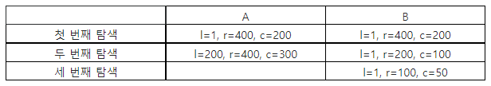

### SWEA 4839. 이진탐색

---

코딩반 학생들에게 이진 탐색을 설명하던 선생님은 이진탐색을 연습할 수 있는 게임을 시켜 보기로 했다.

짝을 이룬 A, B 두 사람에게 교과서에서 각자 찾을 쪽 번호를 알려주면, 이진 탐색만으로 지정된 페이지를 먼저 펼치는 사람이 이기는 게임이다.

예를 들어 책이 총 400쪽이면, 검색 구간의 왼쪽 l=1, 오른쪽 r=400이 되고, 중간 페이지 c= int((l+r)/2)로 계산한다.

찾는 쪽 번호가 c와 같아지면 탐색을 끝낸다.

A는 300, B는 50 쪽을 찾아야 하는 경우, 다음처럼 중간 페이지를 기준으로 왼쪽 또는 오른 쪽 영역의 중간 페이지를 다시 찾아가면 된다.



책의 전체 쪽수와 두 사람이 찾을 쪽 번호가 주어졌을 때, 이진 탐색 게임에서 이긴 사람이 누구인지 알아내 출력하시오. 비긴 경우는 0을 출력한다.

```python
T = int(input())
for tc in range(T):
    P, A, B = map(int, input().split()) # P 전체 쪽 수   A, B가 찾을 쪽 수
    A_cnt, B_cnt = 0, 0
    start, end = 1, P
    while start <= end:
        A_middle = (start + end) // 2
        if A_middle == A:
            A_cnt += 1
            break
        elif A_middle < A:
            start = A_middle
            A_cnt += 1
        else:
            end = A_middle
            A_cnt += 1

    start, end = 1, P
    while start <= end:
        B_middle = (start + end) // 2
        if B_middle == B:
            B_cnt += 1
            break
        elif B_middle < B:
            start = B_middle
            B_cnt += 1
        else:
            end = B_middle
            B_cnt += 1

    if A_cnt > B_cnt: result = 'B'
    elif A_cnt == B_cnt: result = 0
    else: result = 'A'
    print('#{} {}'.format(tc+1, result))
```

