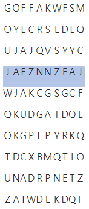

### SWEA 4861. 회문

---

ABBA처럼 어느 방향에서 읽어도 같은 문자열을 회문이라 한다. NxN 크기의 글자판에서 길이가 M인 회문을 찾아 출력하는 프로그램을 만드시오.

회문은 1개가 존재하는데, 가로 뿐만 아니라 세로로 찾아질 수도 있다.

예를 들어 N=10, M=10 일 때, 다음과 같이 회문을 찾을 수 있다.



```python
T = int(input())
for tc in range(T):
    N, M = map(int, input().split())
    arr = [input() for _ in range(N)]
    result = ''
    for i in range(N):
        for j in range(N-M+1):
            if arr[i][j:j+M] == arr[i][j:j+M][::-1]:
                result += arr[i][j:j+M]
    for k in range(N):
        lst = ''
        for a in range(N):
            lst += arr[a][k]
        for a in range(N - M + 1):
            if lst[a:a+M] == lst[a:a+M][::-1]:
                result += lst[a:a+M]
    print('#{} {}'.format(tc+1, result))
```

