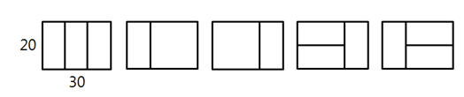

### SWEA 4869. 종이 붙이기

---

어린이 알고리즘 교실의 선생님은 경우의 수 놀이를 위해, 그림처럼 가로x세로 길이가 10x20, 20x20인 직사각형 종이를 잔뜩 준비했다.

그리고 교실 바닥에 20xN 크기의 직사각형을 테이프로 표시하고, 이 안에 준비한 종이를 빈틈없이 붙이는 방법을 찾아보려고 한다. N이 30인 경우 다음 그림처럼 종이를 붙일 수 있다.



10의 배수인 N이 주어졌을 때, 종이를 붙이는 모든 경우를 찾으려면 테이프로 만든 표시한 영역을 몇 개나 만들어야 되는지 계산하는 프로그램을 만드시오. 직사각형 종이가 모자라는 경우는 없다.

```python
T = int(input())
for tc in range(T):
    N = int(input()) // 10
    result = []
    for i in range(N+1):
        if i < 2: result.append(1)
        else:
            result.append(result[i-1]+result[i-2]*2)
    print('#{} {}'.format(tc+1, result[N]))
```

