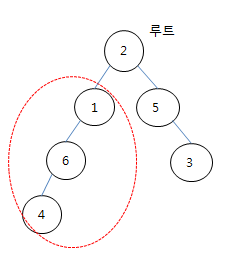

### SWEA 5174. subtree

---


트리의 일부를 서브 트리라고 한다. 주어진 이진 트리에서 노드 N을 루트로 하는 서브 트리에 속한 노드의 개수를 알아내는 프로그램을 만드시오.



주어지는 트리는 부모와 자식 노드 번호 사이에 특별한 규칙이 없고, 부모가 없는 노드가 전체의 루트 노드가 된다.

```python
def cnt_node(v): # 노드의 개수를 세는 함수
    global cnt
    if v:
        cnt += 1
        cnt_node(left[v])
        cnt_node(right[v])
    return cnt

T = int(input())
for tc in range(1, T+1):
    E, N = map(int, input().split())
    arr = list(map(int, input().split()))
    left = [0] * (E+2)
    right = [0] * (E+2)
    for i in range(0, len(arr), 2):
        p, c = arr[i], arr[i+1]
        if not left[p]: # 왼쪽 자식 넣어주기
            left[p] = c
        else: # 오른쪽 자식 넣어주기
            right[p] = c
    cnt = 0
    cnt_node(N)
    print('#{} {}'.format(tc, cnt))
```

