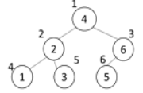

### SWEA 5176. 이진탐색

---

1부터 N까지의 자연수를 이진 탐색 트리에 저장하려고 한다.

이진 탐색 트리는 어떤 경우에도 저장된 값이 왼쪽 서브트리의 루트 <현재 노드 <오른쪽 서브 트리의 루트인 규칙을 만족한다.

추가나 삭제가 없는 경우에는, 완전 이진 트리가 되도록 만들면 효율적인 이진 탐색 트리를 만들수 있다.

다음은 1부터 6까지의 숫자를 완전 이진 트리 형태인 이진 탐색 트리에 저장한 경우이다.



완전 이진 트리의 노드 번호는 루트를 1번으로 하고 아래로 내려가면서 왼쪽에서 오른쪽 순으로 증가한다.

N이 주어졌을 때 완전 이진 트리로 만든 이진 탐색 트리의 루트에 저장된 값과, N/2번 노드(N이 홀수인 경우 소수점 버림)에 저장된 값을 출력하는 프로그램을 만드시오.

```python
def binary(v): # 노드에 수 넣어주는 함수
    global cnt
    if v <= N:
        binary(v*2)
        cnt += 1
        tree[v] = cnt
        binary(v*2+1)
    return tree

T = int(input())
for tc in range(1, T+1):
    N = int(input())
    tree = [0]*(N+1)
    cnt = 0
    binary(1)
    print('#{} {} {}'.format(tc, tree[1], tree[N//2]))
```

