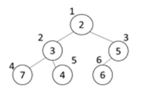

### SWEA 5177. 이진 힙

---

이진 최소힙은 다음과 같은 특징을 가진다.

  \- 항상 완전 이진 트리를 유지하기 위해 마지막 노드 뒤에 새 노드를 추가한다.

  \- 부모 노드의 값<자식 노드의 값을 유지한다. 새로 추가된 노드의 값이 조건에 맞지 않는 경우, 조건을 만족할 때까지 부모 노드와 값을 바꾼다.

  \- 노드 번호는 루트가 1번, 왼쪽에서 오른쪽으로, 더 이상 오른쪽이 없는 경우 다음 줄로 1씩 증가한다.

예를 들어 7, 2, 5, 3, 4, 6이 차례로 입력되면 다음과 같은 트리가 구성된다.



이때 마지막 노드인 6번의 조상은 3번과 1번 노드이다.

1000000이하인 N개의 서로 다른 자연수가 주어지면 입력 순서대로 이진 최소힙에 저장하고, 마지막 노드의 조상 노드에 저장된 정수의 합을 알아내는 프로그램을 작성하시오.

```python
def min_heap(v): # 최소 힙
    global last
    last += 1
    tree[last] = v # 완전 이진 트리 유지
    c = last # 새로 추가된 정점을 자식으로
    p = c//2
    while p >= 1 and tree[p] > tree[c]: # 부모가 있고 자식의 키 값이 더 작으면 교환
        tree[p], tree[c] = tree[c], tree[p]
        c = p
        p = c//2
 
T = int(input())
for tc in range(1, T+1):
    N = int(input())
    tree = [0]*(N+1)
    last = 0 # 마지막 정점 번호
    result = 0 # 조상 노드들의 합
    for i in list(map(int, input().split())):
        min_heap(i)
    while last > 0:
        result += tree[last//2]
        last = last//2
 
    print('#{} {}'.format(tc, result))

```

