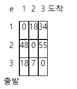

### SWEA 5189. 전자카트

---

골프장 관리를 위해 전기 카트로 사무실에서 출발해 각 관리구역을 돌고 다시 사무실로 돌아와야 한다.

사무실에서 출발해 각 구역을 한 번씩만 방문하고 사무실로 돌아올 때의 최소 배터리 사용량을 구하시오.

각 구역을 이동할 때의 배터리 사용량은 표로 제공되며, 1번은 사무실을, 2번부터 N번은 관리구역 번호이다.

두 구역 사이도 갈 때와 올 때의 경사나 통행로가 다를 수 있으므로 배터리 소비량은 다를 수 있다.

N이 3인 경우 가능한 경로는 1-2-3-1, 1-3-2-1이며 각각의 배터리 소비량은 다음과 같이 계산할 수 있다.

```
e[1][2]+e[2][3]+e[3][1] = 18+55+18 = 91

e[1][3]+e[3][2]+e[2][1] = 34+7+48 = 89
```

 이 경우 최소 소비량은 89가 된다.

```python
# 움직이며 배터리 사용량 구하는 함수
def move(cnt, now, bat):
    global result
    if cnt == N: # N의 수와 같을 경우 마지막 구역에서 사무실까지의 배터리 사용량을 더하기
        bat += arr[now][0]
        if result > bat:
            result = bat
    for i in range(N):
        if not visited[i] and i != now:
            visited[i] = 1
            move(cnt+1, i, bat+arr[now][i])
            visited[i] = 0

T = int(input())
for tc in range(1, T+1):
    N = int(input())
    arr = [list(map(int, input().split())) for _ in range(N)]
    result = 0xffff
    visited = [0]*N
    visited[0] = 1
    move(1, 0, 0)
    print('#{} {}'.format(tc, result))
```

