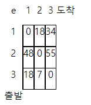

### SWEA 5204. 병합 정렬

---

알고리즘 교수님은 학생들에게 병합 정렬을 이용해 오름차순으로 정렬하는 과제를 내려고 한다.

정렬 된 결과만으로는 실제로 병합 정렬을 적용했는지 알 수 없기 때문에 다음과 같은 제약을 주었다.

N개의 정렬 대상을 가진 리스트 L을 분할할 때 L[0:N//2], L[N//2:N]으로 분할 한다.

병합 과정에서 다음처럼 왼쪽 마지막 원소가 오른쪽 마지막 원소보다 큰 경우의 수를 출력한다.

 

정렬이 끝난 리스트 L에서 L[N//2] 원소를 출력한다.

알고리즘 교수님의 조건에 따라 병합 정렬을 수행하는 프로그램을 만드시오.

```python
def merge(left, right): # 왼쪽과 오른쪽을 비교 후 정렬
    result = []
    l_idx, r_idx = 0, 0
    while l_idx < len(left) or r_idx < len(right):
        if l_idx < len(left) and r_idx < len(right):
            if left[l_idx] <= right[r_idx]:
                result.append(left[l_idx])
                l_idx += 1
            else:
                result.append(right[r_idx])
                r_idx += 1
        elif l_idx < len(left):
            result.append(left[l_idx])
            l_idx += 1
        elif  r_idx < len(right):
            result.append(right[r_idx])
            r_idx += 1
    return result

def merge_sort(a): # 분할하는 함수
    global cnt
    if len(a) == 1: return a
    else:
        mid = len(a)//2
        left = a[:mid]
        right = a[mid:]

        left = merge_sort(left)
        right = merge_sort(right)

        if left[-1] > right[-1]: # 왼쪽의 마지막 원소와 오른쪽의 마지막 원소 비교
            cnt += 1

        return merge(left, right)

T = int(input())
for tc in range(1, T+1):
    N = int(input())
    arr = list(map(int, input().split()))
    cnt = 0
    arr = merge_sort(arr)
    print('#{} {} {}'.format(tc, arr[N//2], cnt))
```

