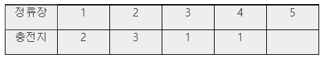

### SWEA 5208. 전기버스2

---

충전지를 교환하는 방식의 전기버스를 운행하려고 한다. 정류장에는 교체용 충전지가 있는 교환기가 있고, 충전지마다 최대로 운행할 수 있는 정류장 수가 정해져 있다.

충전지가 방전되기 전에 교체하며 운행해야 하는데 교체하는 시간을 줄이려면 최소한의 교체 횟수로 목적지에 도착해야 한다.

정류장과 충전지에 대한 정보가 주어질 때, 목적지에 도착하는데 필요한 최소한의 교환횟수를 출력하는 프로그램을 만드시오. 단, 출발지에서의 배터리 장착은 교환횟수에서 제외한다.

다음은 1번에서 출발 5번이 종점인 경우의 예이다.



1번에서 장착한 충전지 용량이 2이므로, 3번 정류장까지 운행할 수 있다. 그러나 2번에서 미리 교체하면 종점까지 갈 수 있다.

마지막 정류장에는 배터리가 없다.

```python
# 충전지 교체하는 함수
def charge(cnt, idx):  # cnt : 교체 횟수, idx 현재 버스 위치
    global result
    if cnt >= result:
        return
    if idx >= N:  # 버스의 위치가 종점이거나 종점을 넘을 때
        if cnt < result:  # 최소 확인
            result = cnt
        return
    else:
        for i in range(1, M[idx]+1):  # 1 ~ 배터리 용량만큼 반복문
            if idx+i > N:  # 버스의 위치가 종점이거나 종점을 넘을 때
                return
            else:  # 다시
                charge(cnt+1, idx+i)

T = int(input())
for tc in range(1, T+1):
    M = list(map(int, input().split()))   # N-1개의 정류장 별 배터리 용량 M
    N = M[0]  # 정류장 수 N
    result = 0xffff
    charge(-1, 1)  # 출발지에서 배터리 장착은 교환 횟수에서 제외하기 때문에 cnt는 -1부터 시작
    print('#{} {}'.format(tc, result))
```

