# 트리

- 트리

- 이진 트리

- 이진 탐색 트리

- 힙

  |           |      그래프(N:N)       |          트리(1:N)           |
  | :-------: | :--------------------: | :--------------------------: |
  | 표현 방법 | 인접 행렬, 인접 리스트 | 완전 이진 트리 : 1차원 배열  |
  |   순회    |        DFS, BFS        | preorder, inorder, postorder |

  

----

> ## 트리
>
> - 비선형 구조
>
> - 원소들 간에 1:n 관계를 가지는 자료구조
>
> - 원소들 간에 계층 관계를 가지는 계층형 자료구조
>
> - 상위 원소에서 하위 원소로 내려가면서 확장되는 트리(나무)모양의 구조
>
>   >**정의**
>
>   ​	한 개 이상의 노드로 이루어진 유한 집합이며 다음 조건을 만족한다.
>
>   ​	노드 중 최상위 노드를 루트(root)라 한다.
>
>   ​	나머지 노드들은 n(>= 0)개의 분리 집합 T1, ..., TN으로 분리될 수 있다.
>
>   ​	이들 T1, ..., TN은 각각 하나의 트리가 되며(재귀적 정의) 루트의 부 트리(subtree)라 한다.
>
>   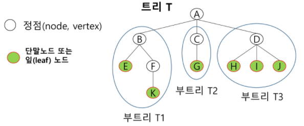 
>
>   > **용어 정리**
>
>   - 노드(node) - 트리의 원소(ex. 트리 T의 노드 - A, B, C, D, E, F, G, H, I, J, K)
>
>   - 간선(edge) - 노드를 연결하는 선. 부모 노드와 자식 노드를 연결
>
>   - 루트 노드(root node) - 트리의 시작 노드(ex. 트리 T의 루트노드 - A)
>
>   - 형제 노드(sibling node) - 같은 부모 노드의 자식 노드들 (ex. B, C, D는 형제 노드)
>
>   - 조상 노드 - 간선을 따라 루트 노드까지 이르는 경로에 있는 모든 노드들 (ex. K의 조상 노드 - F, B, A)
>
>   - 서브 트리(sub tree) - 부모 노드와 연결된 간선을 끊었을 때 생성되는 트리
>
>   - 자손 노드 - 서브 트리에 있는 하위 레벨의 노드들 (ex. B의 자손 노드 - E, F, K)
>     - 차수(degree)
>
>       - 노드의 차수 : 노드에 연결된 자식 노드의 수
>       - 트리의 차수 : 트리에 있는 노드의 차수 중에서 가장 큰 값
>       - 단말 노드(리프 노드) : 차수가 0인 노드. 자식 노드가 없는 노드
>
>   - 높이
>     - 노드의 높이 : 루트에서 노드에 이르는 간선의 수. 노드의 레벨
>     - 트리의 높이 : 트리에 있는 노드의 높이 중에서 가장 큰 값. 최대 레벨


> ## 이진트리
>
> - 모든 노드들이 2개의 서브트리를 갖는 특별한 형태의 트리
>
> - 각 노드가 자식 노드를 최대한 2개까지만 가질 수 있는 트리
>
>   - 왼쪽 자식 노드(left child node)
>   - 오른쪽 자식 노드(right child node)
>
>   > **특성**
>
>   ​	레벨 i에서의 노드의 최대 개수는 2^i 개
>
>   ​	높이가 h인 이진 트리가 가질 수 잇는 노드의 최소 개수는 (h+1)개가 되며, 최대 개수는 (2^(h+1)-1)개가 된다.
>
>   > **종류**
>
>   - **포화 이진 트리(Full Binary Tree)**
>
>     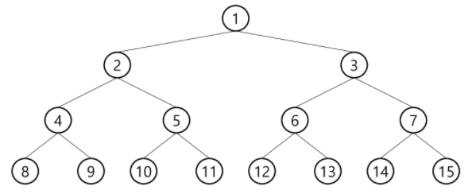 
>
>     - 모든 레벨에 노드가 포화 상태로 차 있는 이진 트리
>     - 높이가 h일 때, 최대의 노드 개수인 (2^(h+1)-1)의 노드를 가진 이진 트리
>     - 루트를 1번으로 하여 (2^(h+1)-1)까지 정해진 위치에 대한 노드 번호를 가짐
>
>   - **완전 이진 트리(Complete Binary Tree)**
>
>     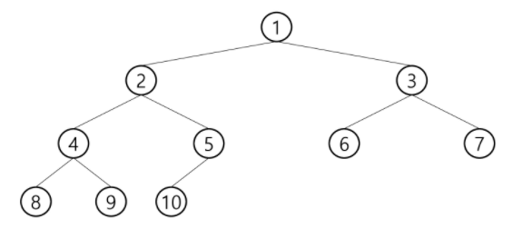 
>
>     - 높이가 h이고 노드 수가 n개일 때 (단, 2^h <= n < (2^(h+1)-1)), 포화 이진 트리의 노드 번호 1번부터 n번까지 빈 자리가 없는 이진 트리
>
>   - **편향 이진 트리(Skewed Binary Tree)**
>
>     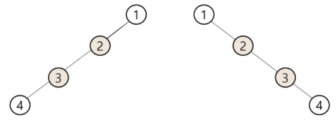 
>
>     - 높이 h에 대한 최소 개수의 노드를 가지면서 한쪽 방향의 자식 노드만을 가진 이진 트리 
>
>       왼쪽 편향 이진 트리, 오른쪽 편향 이진 트리
>
>   > **순회(traversal)**
>
>   - 순회란 트리의 각 노드를 중복되지 않게 전부 방문(visit) 하는 것을 말하는데 트리는 비선형 구조이기 때문에 선형 구조에서와 같이 선후 연결 관계를 알 수 없다.
>
>   - 따라서 특별한 방법이 필요하다.
>
>   - **순회(traversal) : 트리의 노드들을 제계적으로 방문하는 것**
>
>   - 3가지의 기본적인 순회 방법
>
>     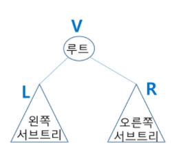 
>
>     **전위순회(preorder taversal) : VLR**
>
>     부모 노드 방문 후, 자식 노드를 좌/우 순서로 방문한다.
>
>     **중위순회(inorder traversal) : LVR**
>
>     왼쪽 자식 노드, 부모 노드, 오른쪽 자식 노드 순으로 방문한다.
>
>     **후위순회(postorder traversal) : LRV**
>
>     자식 노드를 좌우 순서로 방문한 후, 부모 노드로 방문한다.
>   
>     
>   
>   - **전위순회(preorder taversal) : VLR**
>   
>     - 수행 방법
>   
>       1. 현재 노드n을 방문하여 처리한다. -> V
>       2. 현재 노드 n의 왼쪽 서브트리로 이동한다. -> L
>       3. 현재 노드 n의 오른쪽 서브트리로 이동한다. -> R
>   
>     - 전위 순회 알고리즘
>   
>       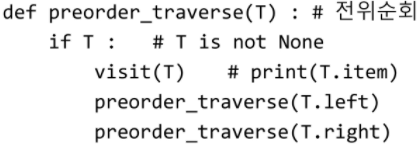 
>   
>     - 전위 순회 예
>   
>       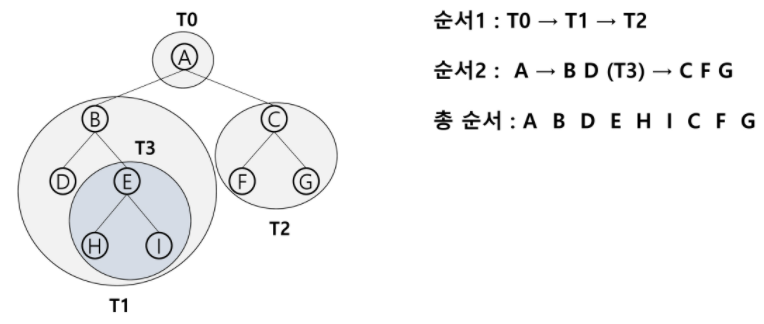
>   
>   - **중위순회(inorder traversal) : LVR**
>   
>     - 수행 방법
>   
>       1. 현재 노드 n의 왼쪽 서브트리로 이동한다. -> L
>   
>       2. 현재 노드n을 방문하여 처리한다. -> V
>   
>       3. 현재 노드 n의 오른쪽 서브트리로 이동한다. -> R
>   
>     - 중위 순회 알고리즘
>   
>       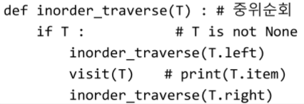 
>   
>     - 중위 순회 예
>   
>   
>     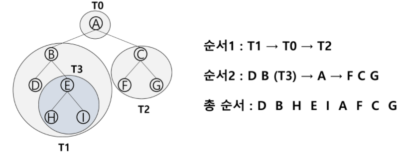
>   
>   - **후위순회(postorder traversal) : LRV**
>   
>     - 수행 방법
>   
>       1. 현재 노드 n의 왼쪽 서브트리로 이동한다. -> L
>   
>       2. 현재 노드 n의 오른쪽 서브트리로 이동한다. -> R
>   
>       3. 현재 노드n을 방문하여 처리한다. -> V
>   
>     - 후위 순회 알고리즘
>   
>       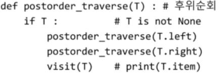 
>   
>     - 후위 순회 예
>   
>       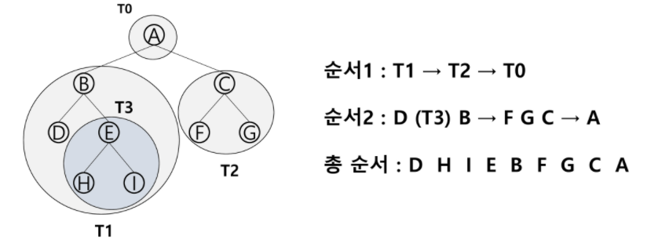
>   
>   
>     ```python
>     # 전위 순회 함수
>     def pre_order(v):
>         if v:
>             print(v)
>             pre_order(ch1[v])
>             pre_order(ch2[v])
>     # 중위 순회 함수
>     def in_order(v):
>         if v:
>             pre_order(ch1[v])
>             print(v)
>             pre_order(ch2[v])
>     # 후위 순회 함수
>     def post_order(v):
>         if v:
>             pre_order(ch1[v])
>             pre_order(ch2[v])
>             print(v)
>     
>     V = int(input())  # 정점의 개수
>     arr = list(map(int, input().split()))
>     
>     ch1 = [0]*(V+1) # 왼쪽 자식
>     ch2 = [0]*(V+1) # 오른쪽 자식
>     for i in range(V-1):
>         p, c = arr[i*2], arr[i*2+1]
>         if ch1[p] == 0:
>             ch1[p] = c
>         else:
>             ch2[p] = c
>     
>     pre_order(1)
>     in_order(1)
>     post_order(1)
>     ```
>   
>     
>   
>   > **표현**
>   
>   - 배열을 이용한 이진 트리의 표현
>   
>   
>     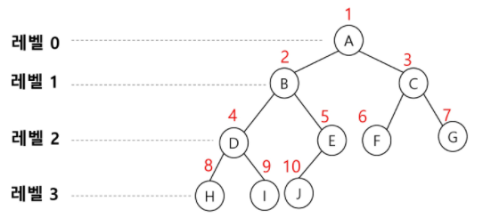 
>   
>   - 이진 트리에 각 노드 번호를 다음과 같이 부여
>   
>   - 루트의 번호를 1로 함
>   
>   - 레벨 n에 있는 노드에 대하여 왼쪽부터 오른쪽으로 2^n 부터 2^(n+1)-1까지 번호를 차례로 부여
>   
>   - 노드 번호의 성질
>   
>       - 노드 번호가 i인 노드의 부모 노드 번호?		i // 2
>       - 노드 번호가 i인 노드의 왼쪽 자식 노드 번호?		2 * i
>       - 노드 번호가 i인 노드의 오른쪽 자식 노드 번호?		2 * i + 1
>       - 레벨 n의 노드 번호 시작 번호는?		2^n
>       - 노드 번호를 배열의 인덱스로 사용
>       - 높이가 h인 이진 트리를 위한 배열의 크기는?		2^(h+1) - 1 (배열의 개수라고 한다면 2^(h+1), 0부터 시작이라서,,)
>   
>       ```
>       이진 tree 정점 번호 규칙
>       - 포화 이진 트리 : 1번이 루트, 부모 번호 < 자식 번호
>       - 그 외 : 1번이 루트가 아닐 수도 있음, '부모 번호 < 자식 번호'이 아닐 수도 있음
>       ```
>   
>       
>   
>   
>   > **이진 트리의 저장**
>   
>   - 부모 번호를 인덱스로 자식 번호를 저장
>   
>   
>       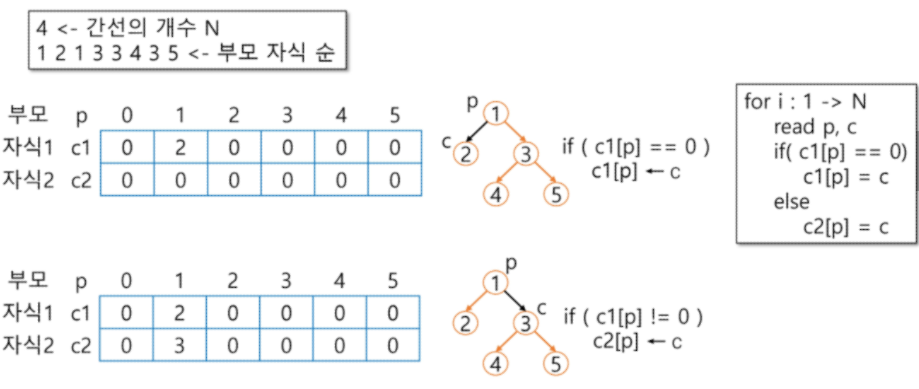
>   
>   - 자식 번호를 인덱스로 부모 번호를 저장
>   
>       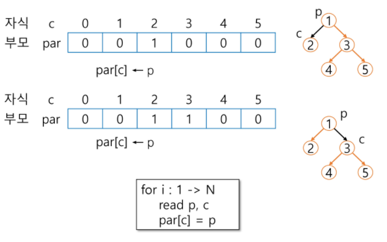 
>   
>   - 루트 찾기, 조상 찾기
>   
>       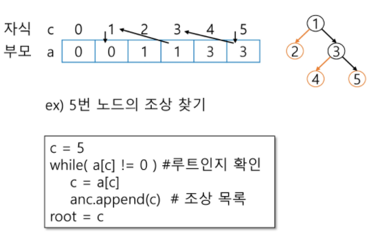
>   
>   - 배열을 이용한 이진 트리의  표현의 단점
>   
>   - 편향 이진 트리의 경우에 사용하지 않는 배열 원소에 대한 메모리 공간 낭비 발생
>   
>   - 트리의 중간에 새로운 노드를 삽입하거나 기존의 노드를 삭제할 경우 배열의 크기 변경 어려워 비효율적
>   
>   
>   
>   > **수식 트리**
>   
>   - 수식을 표현하는 이진 트리
>   
>   - 수식 이진 트리(Expression Binary Tree)라고 부르기도 함
>   
>   - 연산자는 루트 노드이거나 가지 노드
>   
>   - 피연산자는 모두 잎 노드
>   
>       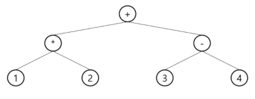
>   
>   - 수식 트리의 순회
>   
>     - 중위 순회 : A / B * C * D + E
>     - 후위 순회 : A B / C * D * E +
>     - 전위 순회 : + * * / A B C D E
>   
>     
>   
>     
>


> ## 이진 탐색 트리
>
> - 탐색 작업을 효율적으로 하기 위한 자료 구조
>
> - 모든 원소는 서로 다른 유일한 키를 갖는다.
>
> - key(왼쪽 서브트리) < key(루트 노드) < key(오른쪽 서브트리)
>
> - 왼쪽 서브트리와 오른쪽 서브트리도 이진 탐색 트리
>
> - 중위 순회하면 오름차순으로 정렬된 값을 얻을 수 있음
>
>   > **연산**
>
>   - 탐색 연산
>
>     - 루트에서 시작
>
>     - 탐색할 키 값 x를 루트 노드의 키 값과 비교
>
>       (키 값 x = 루트 노드의 키 값)인 경우 : 원하는 원소를 찾았으므로 탐색 연산 성공
>
>       (키 값 x < 루트 노드의 키 값)인 경우 : 루트 노드의 왼쪽 서브트리에 대해서 탐색 연산 수행
>
>       (키 값 x > 루트 노드의 키 값)인 경우 : 루트 노드의 오른쪽 서브트리에 대해서 탐색 연산 수행
>
>     - 서브 트리에 대해서 순환적으로 탐색 연산을 반복
>
>   - 삽입 연산
>
>     - 먼저 탐색 연산을 수행
>
>       삽입할 원소와 같은 원소가 트리에 있으면 삽입할 수 없으므로, 같은 원소가 트리에 있는지 탐색하여 확인
>
>       탐색에서 탐색 실패가 결정되는 위치가 삽입 위치
>
>     - 탐색 실패한 위치에 원소를 삽입
>
>   - **탐색, 삽입, 삭제 시간은 트리의 높이 만큼 시간이 걸림**


> ## 힙(heap)
>
> 
